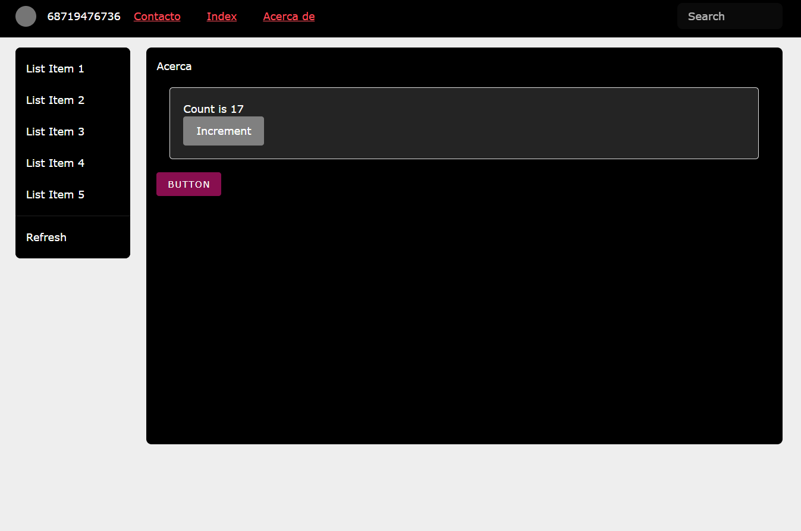
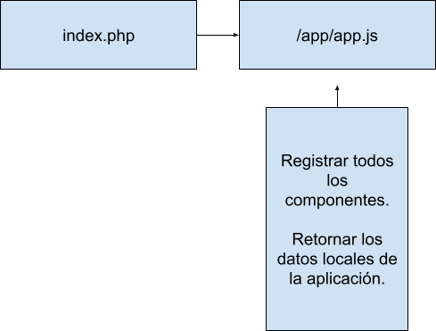

#PROTOTIPO PHP/VUE



> Recuerda que para arrancar este **proyecto** tienes que copiar los archivos del repositorio y con Docker usar el comando `docker-compose up`

>  También puedes arrastrar a un __v-host__ en tu local con php.


```NONE
- index.php

- 📂 app/

  - router.php

  - app.js

  - vue323.js

  - vuetify.js

  - 📁 Componentes/

    - HolaMundoComponent.js

    - PruebaComponent.js

    - SideNavComponent.js
    
    - ...

  - 📁 Paginas/

    - Inicio.php

    - AcercaDe.php

    - Contacto.php

    - ...

  - 📁 Servicios/

    - escrituraService.php

    - lecturaService.php

    - ...

  - 📁 CSS/

    - sdt.css

    - vuetify.css


```



## index.php

El archivo index.php es el punto de entrada principal de la aplicación. En él se está realizando lo siguiente:

1. Se incluye el router.php que contiene la configuración de rutas:

```PHP
require 'app/router.php';
```

2. Se definen los elementos básicos del documento HTML.

3. Se cargan los archivos CSS y JavaScript necesarios:

   - Vue
   - Vuetify
   - Estilos CSS

4. Se define un div con id="app" donde se montará la aplicación Vue.

5. Se define un template con id="app-template" que contiene la interfaz principal.

6. Dentro del template se incluyen los componentes generales como barra de navegación, drawer lateral, etc.

7. Se renderiza dinámicamente la página actual con <?php require ?>

8. Se monta la aplicación Vue creada en app.js dentro del div #app.

9. Se cierra correctamente el HTML.

### app.js

El archivo app.js contiene la configuración y lógica principal de la aplicación Vue. Sus funciones son:

* Importar componentes:
Permite reutilizar componentes de forma centralizada.

* Configurar Vuetify:
Define la configuración base como temas, colores, etc.

* Crear instancia de Vuetify:
Inicializa el plugin para usar sus componentes.

* Definir datos y template de la app:
Especifica los datos y interfaz principal.

* Registrar componentes:
Habilita el uso de componentes importados.

* Utilizar Vuetify como plugin:
Integra funcionalidad de sus componentes.

* Montar la aplicación:
Conecta la lógica Vue con el elemento HTML.

* Agregar event listeners.

* Permite extender la interactividad.

### carpeta componentes

Los componentes que se crean en la carpeta "componentes" pueden ser reusables en cualquier punto de la aplicación.

Para usar un componente basta con agregar su tag correspondiente en el HTML.

Los componentes pueden usar los propios del Vuetify como `<b-btn>`

```PHP
<!--AcercaDe.php-->

Acerca de...

<my-component></my-component>

<v-btn color="primary" id="patata_x" @click="patata_f">

       Button

 </v-btn>

```

Esto aplica tanto para las páginas que se renderizan dinámicamente en "paginas", como en el template principal de index.php siempre y cuando se importen y se declaren en app.js

```JS
// Importaciones de componentes

import PruebaComponent from "./components/PruebaComponent.js";

// Registra los componentes

app.component("my-component", PruebaComponent);

```

Un componente puede contener lógica interna como datos, métodos, props, etc. Su interfaz se define a través de template o render.

Los componentes de Vuetify también se consideran como tales y pueden usarse de la misma manera. Lee la documentación de Vuetify en <https://vuetifyjs.com/en/components/all/>

De esta forma, la carpeta "componentes" permite:

* Reutilizar bloques visuales y funcionales.
* Desacoplar la lógica de las vistas.
* Aprovechar elementos de Vuetify de forma declarativa.

### router.php

El archivo router.php se encarga de la configuración y enrutamiento de las páginas de la aplicación.

Sus funciones principales son:

* Declarar la página actual por defecto (Inicio.php)
* Definir un array con los nombres de las posibles páginas
* Generar el menú nav con enlaces a cada página
* Detectar si viene algún parámetro "pagina" por GET
* Validar que el parámetro coincida con las páginas definidas
* Reasignar la página actual si el parámetro es válido

De esta forma:

* Se mapean internamente las páginas del sitio
* Se redirecciona dinámicamente según la URL
* El formato es index.php?pagina=nombrepagina
* Las páginas deben estar en la carpeta "paginas"
* Siempre se carga una página por defecto

Esto permite navegar entre las distintas vistas de forma amigable para el usuario y centralizada desde este archivo de router. Es una implementación simple pero funcional del enrutamiento en PHP.

# 🤺 TO DO

[ ] Usar localStorage para almacenar algunos datos.  